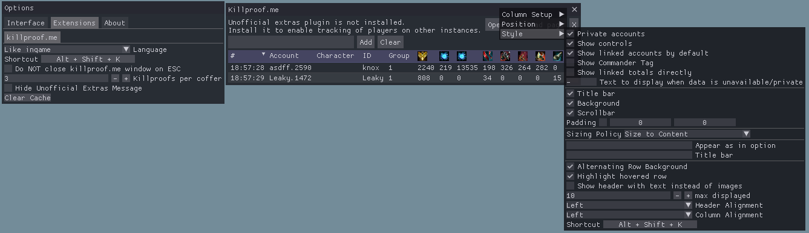

# arcdps killproof.me plugin
A Plugin for arcdps, that is loading killproof.me info and displaying it ingame.

## Contact
For any errors, feature requests and questions, open a new issue here.  
You can also join the [Elite Insights discord](https://discord.gg/dCDEPXx) and write in the channel #killproof-me-plugin.  

## Installation
Requires [ArcDPS](https://www.deltaconnected.com/arcdps/).

Download the latest version from the [releases page](https://github.com/knoxfighter/arcdps-killproof.me-plugin/releases/latest).  
Then put the .dll file into the same folder as arcdps or in your Guild Wars 2 directory.
To disable it, remove the .dll file.

To allow tracking of players outside your current instance, install the [unofficial-extras addon](https://github.com/Krappa322/arcdps_unofficial_extras_releases/releases/latest).

Alternatively, install it with the [Guild Wars 2 Addon manager](https://github.com/fmmmlee/GW2-Addon-Manager/), like multiple other plugins.

## Troubleshooting
If the DLL is not loaded (options do not show up), make sure, that you have installed the latest C++ 2015-2026 Redistributable.
You can download the latest Redistributable from [Microsofts download page](https://docs.microsoft.com/en-us/cpp/windows/latest-supported-vc-redist).
Please use the version "Latest supported v14 (for Visual Studio 2017–2026)".  
If you have problems, that your settings are reset on each startup, delete the file `<GW2>/addons/arcdps/arcdps_killproof.me.json`. This will reset all your settings.

## Usage
Don't be a dick and give people a chance!

This plugin will load the killproof.me profiles, from everybody in your group, when they are on the same map, than you are. That information can be accessed in the killproof.me windows. No information is shown, when the individual has no killproof.me account or it is on private.

Two ways to open the window:  
- Open the arcdps options panel (Alt+Shift+T by default) and enable the "Killproofs" checkbox.
- Use the hotkey Alt+Shift+K. This can be adjusted in the Settings menu (opened also in the arcdps options panel, in "Killproof.me").

To close the window, press the X on the top right, press Escape or use the hotkey Alt+Shift+K again.  
To change what is shown in the table, press rightclick on the header. The table can be sorted by every column, click on the header.  
The killproof.me website will be opened when you click on the accountname or on the username.

## Translations
The plugin is translated to English, French, German and Spanish. French and Spanish Translations are only roughly, so please report any problems with them.

To make a change or correction to one of the translations available in Boon Table, the files containing the text are as follows:
* [Lang.cpp](killproof_me/Lang.cpp)
* [ExtensionTranslations.h](https://github.com/Zinn-o-Matics/arcdps-extension/blob/main/ExtensionTranslations.h)
* [UETranslations.h](https://github.com/Zinn-o-Matics/arcdps-extension/blob/main/UETranslations.h)

It is also possible to add translations with files. If you want to add a translation, create a file in the format `arcdps_killproof_lang_<langCode>.ini` and place it into `addons/arcdps/`.
The langCode is used as ID and also used in the save file to preserve the selected language.
In the settings, the translation key `ET_LangageName` is used to display the name.
The english translation is available as a template [`arcdps_killproof_lang_en.ini`](arcdps_killproof_lang_en.ini).
Comments start with `;` and if a translation is missing, it falls back to english.

## Development

This project is CMake-based and easy setup is done via CMakePresets.
See [CMakeUserPresets.json.example](CMakeUserPresets.json.example) for how to set up your testing gw2 dir.

## LICENSE

This project is licensed with the MIT License.

### arcdps-extension
[arcdps-extension](https://github.com/knoxfighter/arcdps-extension/) is licensed with the MIT License. Also developed by myself.

### arcdps-unofficial-extras
[arcdps_unofficial_extras_releases](https://github.com/Krappa322/arcdps_unofficial_extras_releases) is a closed source addon that this addon can use. The public API included is licensed with the MIT License. Also partially developed by myself.

### json
[json](https://github.com/nlohmann/json) licensed with the MIT License.

### magic_enum
[magic_enum](https://github.com/Neargye/magic_enum) is licensed with the MIT License.

### Dear ImGui
[Dear ImGui](https://github.com/ocornut/imgui) licensed with the MIT License.

### CURL
[CURL](https://curl.se/libcurl/) licensed with the curl license, which is similar to the MIT License.

### ModernIni
[ModernIni](https://github.com/Zinn-o-Matics/modernIni) licensed with the MIT License.

### Game Graphics
© 2026 ArenaNet LLC. All rights reserved. NCSOFT, ArenaNet, Guild Wars, Guild Wars 2, GW2, Heart of Thorns, Path of Fire, End of Dragons, Secrets of the Obscure, Janthir Wilds, Visions of Eternity, and all associated logos, designs, and composite marks are trademarks or registered trademarks of NCSOFT Corporation. All other trademarks are the property of their respective owners.
