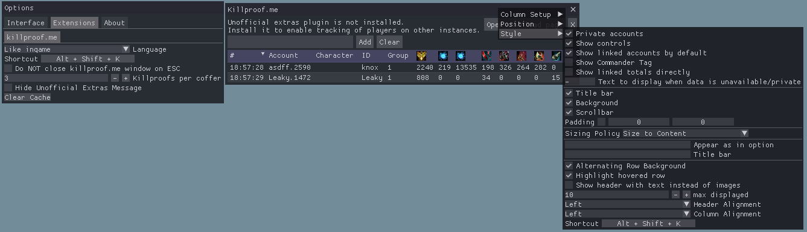

# arcdps killproof.me plugin
A Plugin for arcdps, that is loading killproof.me info and displaying it ingame.

## Contact
For any errors, feature requests and questions, simply open a new issue here.  
You can also join the [Elite Insights discord](https://discord.gg/dCDEPXx) and write in the channel #killproof-me-plugin.  

## Installation
Make sure arcdps is installed. If arcdps is not installed, this plugin is simply not loaded and does nothing.  
Download the latest version from [github releases](https://github.com/knoxfighter/arcdps-killproof.me-plugin/releases/latest).  
Then put the .dll file into the same folder as arcdps (normally `<Guild Wars 2>/bin64`).  
To disable, just remove the .dll or move it to a different folder.

Alternative, install it with the [Guild Wars 2 Addon loader](https://github.com/fmmmlee/GW2-Addon-Manager/), like multiple other plugins.

## Problem solving
If the DLL is not loaded (options do not show up), make sure, that you have installed the latest C++ 2015-2019 Redistributable.
You can download the latest Redistributable from [Microsofts download page](https://support.microsoft.com/en-gb/help/2977003/the-latest-supported-visual-c-downloads).
Please use the version "Visual Studio 2015, 2017 and 2019".

## Usage
Don't be a dick and give people a chance!

This plugin will load the killproof.me profiles, from everybody in your group, when they are on the same map, than you are. Those information, can be accessed in the killproof.me windows. No information is shown, when the individual has no killproof.me account or it is on private.

Two way to open the window:  
- Open the arcdps options panel (Alt+Shift+T by default) and enable the "Killproofs" checkbox. It can be found in the "Killproof.me" category.
- Use the hotkey Alt+Shift+K. This can be adjusted in the Settings menu (opened also in the arcdps options panel, in the "Killproof.me" category).

To close the window, just press the X on the top right, press Escape or use the hotkey Alt+Shift+K again.  
To change what is shown in the table, press rightclick on the header. The table can be sorted by every column, just click on the header.  
The killproof.me website will be opened, when you click on the accountname or on the username.



## Translations
Translations can be added by creating a file in `<Guild Wars 2>/addons/arcdps` called `arcdps_lang_killproof.me.json`.
To create your own translation you can take the example file in [translation](/translations).

## Development

This plugin was developed with visual studio 2019 and vcpkg. It has only one dependency, that has to be installed in vcpkg.

Setup vcpk and install cpr for 64-bit windows programs:
```
git clone https://github.com/Microsoft/vcpkg.git
cd vcpkg
./bootstrap-vcpkg.sh
./vcpkg integrate install
./vcpkg install cpr:x64-windows-static-md
```

Then download this project and open it with Visual Studio. Everything should be set up and you should be able to compile it.  
The default output directory is `C:\Program Files\Guild Wars 2\bin64\`, you can change that in `Properties -> Configuration Properties -> General -> Output Directory`. Also, running the Local Windows Debugger, will start `C:\Program Files\Guild Wars 2\Gw2-64.exe` and attaches the debugger to it. Make sure to NOT use your normal account, cause you could get banned for it!

## LICENSE

This project is licensed with the MIT License.

### Dear ImGui
[Dear ImGui](https://github.com/ocornut/imgui) is also licensed with the MIT License and included as git submodule to this project.

### json
[json](https://github.com/nlohmann/json) is a json library created by nlohmann and licensed with the MIT License. It is included into this project with a single file [json.hpp](/json.hpp).

### cpr
[cpr](https://github.com/whoshuu/cpr) is a http library, that is licensed with the MIT License. It is included with vcpkg and itself has dependencies.
